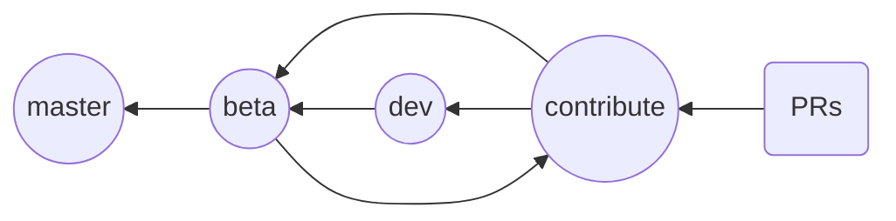

# CONTRIBUTING

When contributing to this repository, please discuss the changes you wish to make first via [issues](https://github.com/AhmedAyachi/Vritra/issues).
Please stay active when working on a certain issue.

## Conventions To Follow

When you are working with git, please be sure to follow the conventions below on your pull requests, branches and commits:
```
PR: #[ISSUE ID] PR Title
Branch: [ISSUE ID]-pr-title
Last Commit before PR: [ACTION]: changes made
```
Example:
```text
PR: #7 Fix Something
Branch: 7-fix-something (you can make it shorter if it's too long)
Commit: fix: fixing some bug in some component
```
## Installation
To start contributing to the project, follow these steps:

 1. Fork this repo
 2. Clone your fork	
	  ```git clone https://github.com/<YOUR_GITHUB_ACCOUNT_NAME>/Vritra```
 3. Navigate to the project folder
	 ```cd Vritra```
4. Install the project dependencies (None at the moment and planning to keep it that way but just in case )
	```npm i```
5. create a vritra-app to test your changes with (Not in the vritra package folder of course)
    ```npx create-vritra-app TestApp```
6. Navigate to your test app folder 
	```cd TestApp```
7. Remove the vritra package installed through the npx command
	```npm rm vritra```
8. Install your local vritra package using npm
    ``npm i file:///<PACKAGE_LOCATION>/Vritra``
    >This will install your local repo as a symbolic link so changes made in your local copy is reflected in your test app
     
9. Add the cordova-browser platform
    ```cordova platform add browser@7```
10. Start the app dev server
	```npm start``` 
11. Start editing your local vritra package and testing your code

## Branching Philosophy

- master : a release branch.
- beta : a pre-release branch that makes sure that the code merged from ***dev*** and ***contribute*** is coherent and stable enough.
- dev : development branch.
- contribute : PRs branch that makes sure that all PRs are coherent with each other and with the latest code.

## Notes
- PRs without an issue or with no issue reference in the title will be rejected.
- PRs targeting any branch other than the ***contribute*** branch will be rejected.
- PRs with code that require dependencies will be rejected (for the moment).
- Make sure to pull the latest version of the upstearm/master branch before you submit a PR.
    ```
    /* add remote */
    git remote add upstream https://github.com/AhmedAyachi/Vritra
    
    /* Update your master */
	git checkout master
	git pull upstream master
	```
- Make sure you code works as expected before before submitting a PR.

>A lot of things to consider and it's easy to miss some steps so if it was your first time and your PR was rejected because there was no issue associated with it, simply create the issue and submit a new PR. 

### Thanks for your intention to contribute.